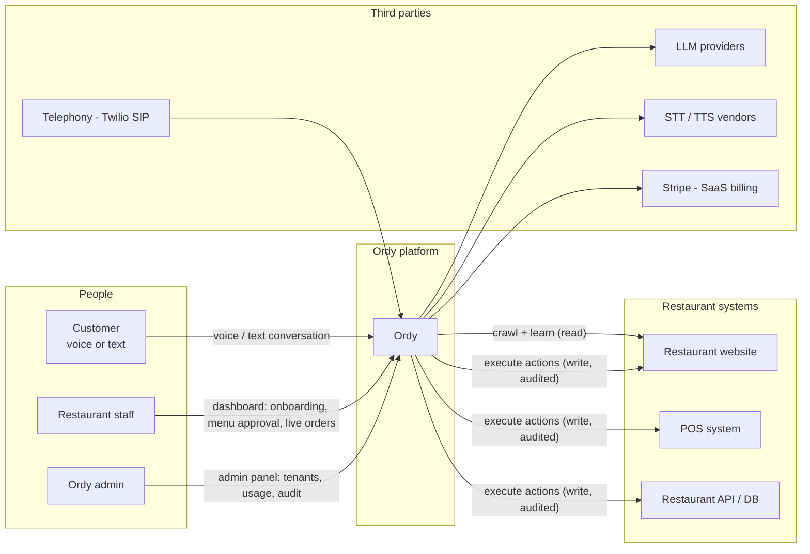
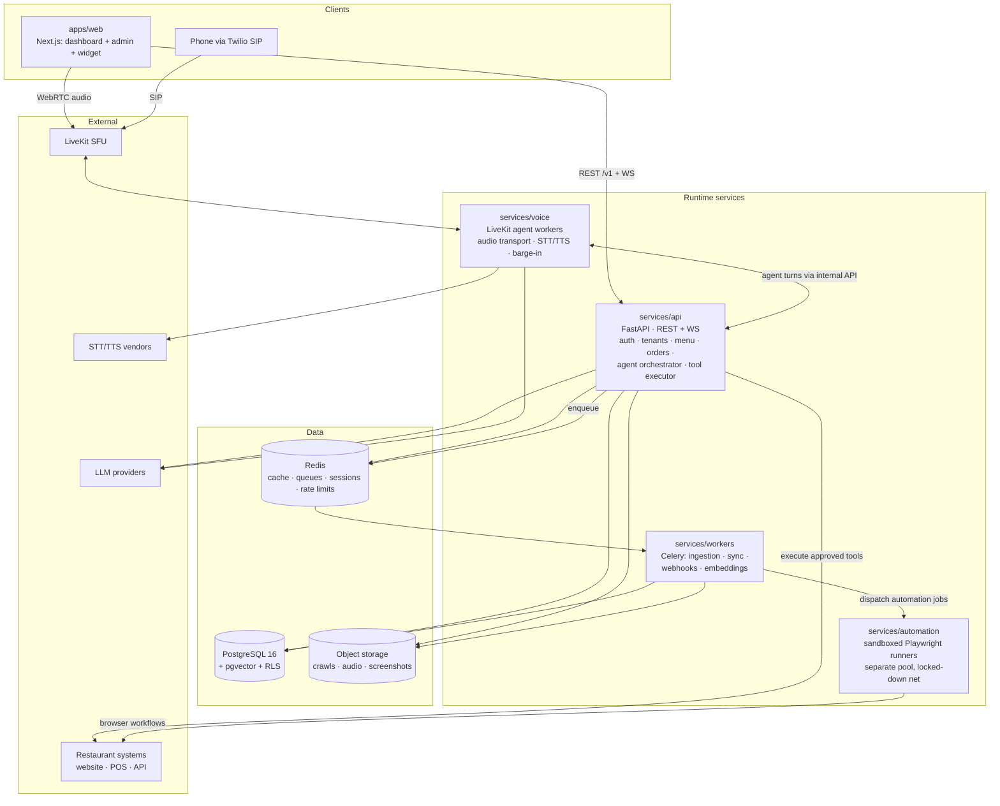
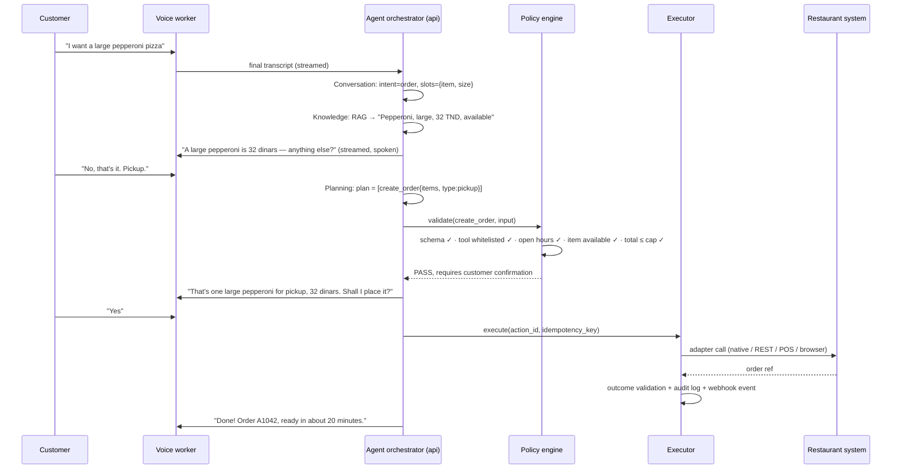

# 01 — System Architecture

Ordy is the AI waiter layer between customers and restaurants: a multi-tenant SaaS where each restaurant gets a voice agent that knows its menu, speaks its languages, and can execute real operations (orders, reservations, availability checks) against its systems — without the model ever having direct access to those systems.

## 1. Architectural principles

These six principles are load-bearing. Every design decision in this repo traces back to at least one of them.

1. **The LLM is a proposer, never an executor.** Models emit *intents* as typed tool calls. A deterministic policy engine, validators, and a secure executor stand between every model output and every side effect. There is no code path from model output to SQL, HTTP, or browser input that skips validation.
2. **API-first.** Every capability of the platform — onboarding, knowledge, orders, conversations — is a versioned REST/WS API with an OpenAPI contract. The dashboard, the widget, and third-party integrators are all just API clients. The TypeScript SDK is generated from the contract, never hand-written.
3. **Tenant isolation by construction.** `restaurant_id` scoping is enforced at the database layer (PostgreSQL Row-Level Security), not just in application code. Vector namespaces, Redis key prefixes, object-storage prefixes, and tool whitelists are all tenant-partitioned. A cross-tenant read must defeat two independent layers to occur.
4. **Human-in-the-loop where money or truth is at stake.** AI-extracted menus and prices are drafts until a human approves them. State-changing actions require explicit customer confirmation. Financial and irreversible actions carry hard caps and per-tenant whitelists.
5. **Provider-agnostic AI.** Model IDs, voice vendors, and vector stores sit behind thin ports (`ModelRouter`, `SpeechPipeline`, `VectorStore`). Defaults are OpenAI + Deepgram + pgvector; swapping any of them is a config change plus an adapter, not a rewrite.
6. **Modular monolith first, services where physics demand it.** One well-modularized API deployable, with separate deployables only where the runtime profile genuinely differs: long-lived audio sessions (voice), untrusted browser execution (automation), and background jobs (workers). Package boundaries keep later extraction cheap. (See ADR-002.)

## 2. System context



Three audiences, three surfaces:

| Surface | Users | Purpose |
|---|---|---|
| **Customer voice interface** | Restaurant's customers | Embeddable web widget, hosted page (`order.ordy.ai/{slug}`), phone number (later) |
| **Restaurant dashboard** | Owners, managers, staff | Onboarding, knowledge review, agent config, live orders/reservations, conversations, analytics |
| **Admin panel** | Ordy operators | Tenant management, ingestion monitoring, cost/usage, feature flags, audit search |

## 3. Container topology



Five deployables. Everything else is a managed dependency.

| Deployable | Runtime | Scaling profile | Why it is separate |
|---|---|---|---|
| `apps/web` | Next.js (Node) | Stateless, CDN-heavy | Frontend release cadence ≠ backend |
| `services/api` | FastAPI + LangGraph | Stateless, CPU-light, LLM-I/O-bound | The modular monolith: API + agent brain + tool executor |
| `services/voice` | LiveKit Agents (Python) | Long-lived sessions, latency-critical | Audio sessions pin workers for minutes; must scale and fail independently of REST traffic |
| `services/workers` | Celery | Bursty, throughput-oriented | Crawls and embedding jobs must never compete with request latency |
| `services/automation` | Playwright in hardened containers | Bursty, untrusted execution | Security blast-radius isolation (see §4.6 and doc 08) |

## 4. Components

### 4.1 Frontend — `apps/web`

One Next.js app, three route groups:

- **`(dashboard)`** — restaurant-facing.
  - *Onboarding wizard*: enter a URL / DB credentials / GitHub repo / OpenAPI doc → watch the ingestion run live → **review & approve** the extracted menu, hours, policies, and the proposed Capability Map before anything goes live.
  - *Knowledge*: browse/edit documents, see provenance (which page each fact came from), trigger re-sync, view diffs when the source site changes.
  - *Menu manager*: full CRUD for restaurants that prefer manual entry; publish/draft states.
  - *Agent studio*: persona, greeting, languages, voice selection, escalation rules; a **text sandbox** to converse with the agent before enabling voice.
  - *Operations*: live order feed (with sound/print hooks), reservation calendar, conversation transcripts with audio playback, handoff inbox.
  - *Settings*: members & roles, API keys, webhooks, tool whitelist with per-tool caps, billing.
- **`(admin)`** — Ordy-internal: tenant list, ingestion run inspector, per-tenant token/audio cost, feature flags, global audit search. Gated by platform-admin role.
- **`(widget)`** — the embeddable customer voice UI, also served standalone at `order.ordy.ai/{slug}`. Ships as a `<script>` one-liner (`packages/widget`) that mounts a mic button + transcript panel + cart/confirmation sheet; connects to LiveKit for audio and to `/v1/public` for session bootstrap.

### 4.2 Core API — `services/api`

FastAPI, structured as vertical modules behind one router (full module list in doc 09):

| Module | Responsibility |
|---|---|
| `auth` | Register/login, OAuth (Google), JWT access+refresh rotation, API keys, RBAC |
| `restaurants` | Tenant CRUD, members, settings, hours, delivery zones |
| `menu` | Menus, categories, products, variants, modifiers; draft/publish lifecycle |
| `knowledge` | Sources, ingestion runs, documents, review/approval, search debug |
| `capability` | Capability maps, tool catalog, per-tenant tool enablement + caps |
| `conversations` | Session lifecycle, turn storage, live monitoring stream, handoff |
| `orders` / `reservations` | State machines, timelines, dashboard mutations |
| `agent` | The LangGraph orchestrator (doc 03) — invoked internally by voice/chat sessions |
| `actions` | The tool-execution pipeline: policy engine → validators → executors → audit (doc 03 §4) |
| `webhooks` | Outbound event delivery with HMAC signatures and retries |
| `billing` | Stripe subscriptions, usage metering |
| `admin` | Platform-admin endpoints |

Cross-cutting middleware (in order): request-ID → auth → **tenant context** (sets the RLS session variable) → rate limiting (Redis token bucket per API key / IP / tenant) → audit hooks → problem+json error mapping.

**Why the agent lives inside the API service:** the orchestrator is stateless per-turn (state persists in Postgres/Redis), shares every domain model with the API, and its latency profile is the same LLM-bound I/O. Splitting it out now would buy network hops and version skew, not scalability. It is packaged as `libs/ordy-agent` so extraction later is a deployment change (ADR-002).

### 4.3 AI layer (summary — full design in doc 03)

- **Orchestrator**: a LangGraph supervisor graph. Five roles — Conversation, Knowledge, Planning, Validation, Execution. Conversation/Knowledge/Planning are LLM nodes; **Validation is deterministic code first** (schema → policy → business rules), with LLM assistance only for ambiguity detection; Execution is pure code.
- **RAG pipeline**: hybrid retrieval (pgvector similarity + Postgres full-text) over approved knowledge chunks, tenant-filtered at the SQL layer, with provenance attached to every retrieved chunk. Menus are small corpora (hundreds of chunks), so retrieval is fast and re-indexing is cheap.
- **Memory**: session state (cart, confirmed facts, pending confirmations) in Redis with Postgres write-through; customer long-term memory (name, usual order, allergies — consent-gated); conversation history in Postgres.
- **Model router**: named tiers (`REALTIME_SPEECH`, `CONVERSATION`, `PLANNING`, `EXTRACTION`, `CLASSIFIER`) mapped to concrete model IDs in config, per-tenant overridable. No model ID appears in code.

### 4.4 Voice layer (summary — full design in doc 05)

LiveKit is the transport backbone: browser widget joins a room over WebRTC; phone calls arrive via Twilio SIP → LiveKit SIP bridge. A `services/voice` worker joins each room and runs one of two pipelines:

- **Mode A — realtime speech-to-speech** (OpenAI Realtime class models): lowest latency, native barge-in; used for English/French.
- **Mode B — modular pipeline** (Deepgram streaming STT → agent turn → streaming TTS): full control, per-stage vendor choice; the path for Tunisian Derja and for cost-sensitive tenants.

Both modes call the same agent orchestrator — voice is a transport, not a second brain. Latency budget: ≤ 800 ms p50 voice-to-voice, with streaming at every stage and spoken acknowledgments covering tool execution.

### 4.5 Ingestion layer (summary — full design in doc 04)

Celery pipelines that turn a URL / DB connection / repo / API doc into two artifacts:

1. **Knowledge Base** — structured documents (menu, hours, policies, FAQ) with provenance, embedded into pgvector *after* human approval.
2. **Capability Map** — a machine-readable statement of what actions are possible against this restaurant's systems and how (native Ordy store, REST adapter, POS connector, or browser workflow), which compiles into the tenant's tool registry *after* human approval.

Continuous monitoring re-crawls sources, diffs content, and routes changes (especially prices) back through review.

### 4.6 Automation layer (summary — full design in docs 04 §6 and 08 §5)

For restaurants whose only interface is their website: AI-generated, human-verified Playwright workflows (`open site → find product → select size → add to cart → submit order`) executed in hardened containers — non-root, no filesystem persistence, egress allow-listed to the target domain only, every step screenshotted and DOM-snapshotted into object storage. The agent never enters payment credentials; checkout stops at cash-on-pickup/delivery or a payment link sent to the customer (ADR-011).

### 4.7 Data layer

| Store | Role | Notes |
|---|---|---|
| PostgreSQL 16 | System of record + vectors | RLS on every tenant table; pgvector HNSW for embeddings; monthly partitions for turns/actions/audit (doc 06) |
| Redis | Cache, queues, sessions, rate limits | Key convention `t:{restaurant_id}:…`; Celery broker; voice session state; token buckets |
| Object storage (S3 API) | Blobs | Crawl snapshots, audio recordings, automation screenshots; per-tenant prefixes; lifecycle rules (e.g., audio 30-day default) |

### 4.8 Integration layer

All external execution flows through **executor adapters** behind one interface (doc 03 §4.4):

- `NativeAdapter` — Ordy's own order/reservation store. **Every restaurant gets this on day one**; it is the wedge product (orders land in the dashboard with notification/printing) and the fallback when integrations break.
- `RestAdapter` — calls the restaurant's own API, bound via the Action Provider spec (doc 07 §6) or a per-tenant mapping generated from their OpenAPI doc.
- `PosAdapter` — vendor connectors (Square first; Toast/Lightspeed later) behind a common POS port.
- `BrowserAdapter` — dispatches a verified workflow to `services/automation`.

The Capability Map decides which adapter backs each tool for each tenant.

## 5. Core flows

### 5.1 Voice order (happy path)



If any validation fails, the rejection reason flows back to the Conversation agent, which explains and repairs conversationally ("The kitchen closes at 22:00 — I can schedule it for tomorrow…"). If execution fails, the executor retries idempotently, then falls back to `NativeAdapter` + staff notification rather than losing the order.

### 5.2 Restaurant onboarding

```
URL / DB / repo / API doc
   → Discover (crawl, sitemap, robots-aware, Playwright rendering)
   → Extract (structured-output LLM extraction: menu, prices, hours, policies; OCR for PDF menus)
   → Analyze code (OpenAPI parse, route/model detection, form & flow tracing)
   → Synthesize (draft Knowledge Base + draft Capability Map)
   → HUMAN REVIEW in dashboard (edit, correct, approve — prices never auto-publish)
   → Publish (embed chunks, activate tools, agent goes live in text sandbox → voice)
   → Monitor (scheduled re-crawl, diff, changes re-enter review)
```

### 5.3 Live event fan-out

Order/reservation/handoff events publish to Redis Streams → (a) dashboard live feed over WebSocket, (b) webhook deliveries with HMAC signature + retry/backoff, (c) usage metering.

## 6. Deployment model

- **Local dev**: single `docker compose up` — Postgres, Redis, MinIO, LiveKit dev server, all services with hot reload. Seed script creates a demo restaurant with a menu.
- **Environments**: `dev` → `staging` → `prod`, config via environment variables (12-factor), secrets from the platform secret manager (cloud KMS-backed; restaurant credentials envelope-encrypted — doc 08 §4).
- **Production (Kubernetes)**: one Deployment per runtime service; HPA on CPU + custom metrics (active voice sessions for `voice`, queue depth for `workers`); automation runners in a dedicated node pool with restrictive NetworkPolicy and gVisor/Kata runtime class where available; managed Postgres + Redis; CDN in front of `apps/web` and the widget bundle.
- **Migrations**: Alembic, forward-only, run as a pre-deploy job; expand-migrate-contract discipline for zero-downtime.
- **Observability**: OpenTelemetry traces stitched across widget → API → agent nodes → tool executions; Langfuse for LLM traces/evals; per-tenant cost meters (tokens, audio minutes, actions) feeding both billing and margin dashboards; structured JSON logs with PII redaction at the logger boundary.

### Non-functional targets (v1)

| Dimension | Target |
|---|---|
| Voice-to-voice latency | ≤ 800 ms p50 · ≤ 1500 ms p95 |
| API latency (CRUD) | ≤ 150 ms p95 |
| Availability | 99.5% platform; voice sessions degrade to "please call the restaurant" message, orders degrade to NativeAdapter |
| Tenant scale | 1 000 restaurants, 50 concurrent voice sessions platform-wide on baseline sizing (both scale horizontally) |
| Data isolation | RLS enforced + automated cross-tenant test suite in CI |

## 7. What v1 deliberately does not do

- No card processing in-conversation (PCI avoidance — ADR-015): payment links or pay-at-pickup.
- No multi-location org hierarchy (schema leaves room: `restaurants` is the tenant; an `organizations` layer can wrap it later).
- No custom model fine-tuning (Derja handled via pipeline choice + custom vocabulary first; fine-tuning is a later optimization).
- No delivery-platform integrations (Glovo etc.) — post-v1 adapter work.
