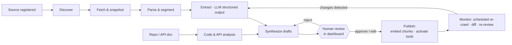

# 04 — Restaurant Intelligence & Ingestion Pipeline

Onboarding is Ordy's magic moment: a restaurant provides a URL (or DB, repo, API doc), and minutes later reviews a draft of its own menu, hours, policies — and a proposed set of actions the agent can perform. This doc specifies the pipeline that makes that happen, and the Capability Map format that bridges "what we learned" to "what the agent may do."

Two outputs, always:

1. **Knowledge Base** — what the agent *knows* (menu, prices, hours, policies), draft-first, human-approved (ADR-012).
2. **Capability Map** — what the agent *can do* and via which adapter, draft-first, human-approved, compiled into the tenant's tool registry.

## 1. Input modes

| Mode | Input | What we get | Trust level |
|---|---|---|---|
| **Website** | Public URL | Menu, prices, hours, policies from rendered pages; cart/checkout/booking flow detection | Untrusted content — full quarantine |
| **Database** | Read-only connection string (encrypted at rest, least-privilege role required) | Schema introspection → products/prices/orders tables; freshest source of truth | Structured but still reviewed |
| **GitHub repo** | Repo URL + token (read-only) | Routes, models, API endpoints, frontend forms/flows → capability candidates | Code-derived, reviewed |
| **API documentation** | OpenAPI/Swagger URL or file | Typed endpoints → direct tool bindings | Strongest capability source |
| **Manual/upload** | Dashboard forms, PDF/image menus | OCR + extraction, or hand-entered | Fallback that always works |

Modes combine: a typical tenant is website (knowledge) + OpenAPI (capabilities), or website-only (knowledge + browser-workflow capabilities), or nothing (manual menu + `NativeAdapter` — still a fully working voice agent taking orders into the dashboard).

## 2. Pipeline



Each run is an `ingestion_runs` row with per-stage status, stats, and errors — the dashboard renders it live. Stages are Celery tasks on the `ingestion` queue; every intermediate artifact (raw HTML, screenshots, parsed segments, extraction JSON) is stored in object storage under `t/{restaurant_id}/ingest/{run_id}/…` for provenance and debugging.

### 2.1 Discover
Sitemap + robots.txt (respected) + shallow BFS crawl within the registered domain, depth ≤ 3, page cap (default 150). A `CLASSIFIER`-tier model labels URLs by likely type (`menu | hours | contact | policy | ordering | booking | other`) from URL + title + snippet, so extraction spends tokens only where it matters.

### 2.2 Fetch & snapshot
Playwright rendering (JS-heavy sites are the norm), desktop + mobile viewports, full-page screenshot + serialized DOM + extracted text per page. Politeness: rate-limited, identified user agent (`OrdyBot/1.0 (+https://ordy.ai/bot)`), per-domain concurrency 2.

### 2.3 Parse & segment
DOM → semantic segments (headings, lists, tables, prices detected by locale-aware money regexes — TND/EUR/USD). PDF menus → text layer, else OCR. Image menus → vision-model extraction (`EXTRACTION` tier with image input). Output: typed `Segment[]` with source URL + DOM path (provenance anchors).

### 2.4 Extract (structured output)
`EXTRACTION`-tier calls with strict JSON schemas per document type. Core schemas:

```json
{
  "MenuItem": {
    "name": "str", "description": "str?", "category": "str",
    "price_minor": "int?", "currency": "str",
    "variants": [{"name": "str", "price_minor": "int"}],
    "modifiers": [{"group": "str", "options": [{"name": "str", "price_delta_minor": "int"}]}],
    "allergens": ["str"], "tags": ["str"], "spice_level": "int?",
    "confidence": "float", "provenance": {"url": "str", "dom_path": "str", "snippet": "str"}
  },
  "OpeningHours": {"service": "dine_in|pickup|delivery|reservation", "day": "mon..sun", "opens": "HH:MM", "closes": "HH:MM", "provenance": {}},
  "Policy":      {"kind": "delivery|cancellation|payment|dietary|other", "text": "str", "structured": {}, "provenance": {}},
  "Promotion":   {"name": "str", "rule_text": "str", "structured_rule": {}, "valid_from": "date?", "valid_to": "date?", "provenance": {}}
}
```

Every extracted fact carries `confidence` + `provenance`. Extraction never merges across pages silently — cross-page dedup happens in Synthesize with the merge recorded.

### 2.5 Code & API analysis

**OpenAPI docs (best case):** parse spec → filter endpoints by capability heuristics (`POST /orders`, `GET /availability`, `POST /reservations`…) → generate *tool binding candidates* mapping ToolSpec inputs to endpoint parameters, including auth scheme. Human maps/edits anything ambiguous in review.

**Backend repo:** static analysis (framework-aware route detection for Express/Laravel/Django/Rails/FastAPI; model/migration parsing for entity discovery). Produces endpoint + entity inventories with file/line provenance. LLM assistance summarizes handler behavior; summaries are labeled as inferred, and repo-derived bindings always require human confirmation.

**Frontend repo / rendered site:** detect forms (fields, validation), cart interactions (add-to-cart selectors, size/option pickers), checkout steps, booking widgets. For website-only restaurants this drives **browser workflow generation** (§6).

**Database:** read-only introspection (tables, columns, FKs, row samples with PII columns excluded by heuristic + never stored raw) → entity mapping proposals (products table → menu sync; orders table → *never* written directly — DB mode yields knowledge sync and read-only checks; writes go through the restaurant's real interfaces or `NativeAdapter`).

### 2.6 Synthesize
Merge extractions across pages/sources into: draft `knowledge_documents` (+ chunk plan), draft menu entities (categories/products/variants/modifiers mapped to our schema), draft hours/zones/policies, and the draft **Capability Map**. Conflicts (same item, two prices) are flagged, not resolved silently.

### 2.7 Human review
The dashboard renders drafts as an editable diff-style review: side-by-side extracted item ↔ source screenshot snippet (provenance makes this one click). Bulk approve, inline edit, reject. **Prices and the Capability Map cannot activate without explicit approval** (ADR-012). Review actions are audited.

### 2.8 Publish
Approved menu entities upsert into the live menu tables (versioned). Approved documents chunk (heading-aware, ~300-token target, overlap 40) → embed (`EMBEDDING` tier) → `knowledge_chunks` in the same transaction as the approval flip: searchable *iff* approved. Approved Capability Map compiles to `restaurant_tools` rows (tool → adapter binding + caps). Agent becomes testable in the text sandbox immediately; voice enable is a separate explicit switch.

### 2.9 Monitor
Scheduled re-crawls (default daily for menu pages, weekly full). Change detection by content hash + semantic diff. Non-substantive changes (typo, formatting) auto-approve; **price/availability/hours changes enqueue a one-tap review** and notify staff. If a source breaks (site down, selectors gone), knowledge stays live (stale-marked internally) and staff are notified — the agent never silently loses its menu.

## 3. Capability Map

The bridge between analysis and the tool registry. Draft → approved → compiled.

```json
{
  "capability_map_version": "1.0",
  "restaurant_id": "res_01J8…",
  "generated_from": ["run_01J8…"],
  "status": "draft",
  "capabilities": [
    {
      "action": "create_order",
      "feasible": true,
      "adapter": "browser",
      "confidence": 0.82,
      "binding": {
        "workflow_id": "wf_01J8…",
        "target_domain": "pizzarustica.tn"
      },
      "constraints": {"order_types": ["pickup", "delivery"], "payment": ["cash_on_delivery"]},
      "evidence": [{"kind": "flow_trace", "url": "https://pizzarustica.tn/menu", "artifact": "s3://…/trace_checkout.json"}]
    },
    {
      "action": "make_reservation",
      "feasible": false,
      "reason": "no booking capability detected on site",
      "fallback": "native"
    },
    {
      "action": "check_availability",
      "feasible": true,
      "adapter": "native",
      "confidence": 1.0,
      "binding": {"source": "published_menu"}
    }
  ],
  "knowledge": {
    "menu_items": 47, "categories": 6, "documents": 12,
    "coverage": {"hours": true, "delivery_policy": true, "allergens": "partial"}
  }
}
```

Rules: every platform action gets an entry (feasible or not, with reason); `native` adapter is always available as capability or fallback; approval compiles `feasible && approved` entries into `restaurant_tools`; the map is versioned — re-ingestion produces a new draft diffed against the active one.

## 4. Provenance (load-bearing, not decoration)

Every knowledge chunk and menu field keeps `{source_url, dom_path/page, snippet, extracted_at, run_id, confidence, approved_by}`. This powers: the review UI (show source next to claim), agent debugging ("why did it say delivery is free?" → click through to the page that said so), the injection quarantine boundary (retrieved text is *known* to be external content — doc 08 §6), and staleness tracking.

## 5. Failure modes & fallbacks

| Failure | Behavior |
|---|---|
| Bot-walled / CAPTCHA site | Stop (no evasion — policy). Ask restaurant to upload menu or connect another source |
| JS app with no crawlable content | Playwright rendering usually suffices; else screenshot-based vision extraction; else manual |
| PDF/image-only menu | OCR + vision extraction path (lower confidence → review emphasizes these) |
| Ambiguous prices (e.g., "from 12 TND") | Extracted as variant-priced or flagged `needs_review`, never guessed to a single price |
| Site changed, workflow selectors broken | Workflow auto-disabled → tool falls back to `NativeAdapter`; staff + Ordy ops notified; re-generation queued |
| Source DB unreachable | Knowledge marked stale after threshold; agent keeps serving last approved state |

## 6. Browser workflow generation (for website-only restaurants)

Generation happens at **onboarding time** (not order time — ADR-011):

1. **Trace:** an exploration agent (LLM + Playwright in the sandbox) attempts the target flow (add item → cart → checkout) against the live site or a recorded snapshot, producing an action trace with screenshots.
2. **Compile:** the trace compiles into a declarative workflow — typed steps with primary + fallback selectors, expected-state assertions after each step, and **parameter slots** (`{product_query}`, `{variant_label}`, `{quantity}`, `{customer_name}`, `{phone}`):

```json
{
  "workflow_id": "wf_01J8…",
  "action": "create_order",
  "target_domain": "pizzarustica.tn",
  "steps": [
    {"op": "goto", "url": "https://pizzarustica.tn/menu"},
    {"op": "search_click", "strategy": ["css:[data-item='{product_query}']", "text:{product_query}"], "assert": "item_page_or_modal"},
    {"op": "select_option", "target": "size", "value": "{variant_label}", "assert": "option_selected"},
    {"op": "click", "target": "add_to_cart", "assert": "cart_count_increased"},
    {"op": "goto_cart_checkout", "assert": "checkout_form_visible"},
    {"op": "fill_form", "fields": {"name": "{customer_name}", "phone": "{phone}"}, "never_fill": ["card_number", "cvv", "password"]},
    {"op": "select_option", "target": "payment", "value": "cash", "assert": "payment_cash_selected"},
    {"op": "confirm_order", "requires": "platform_confirmed_action", "assert": "order_confirmation_visible", "capture": "order_reference"}
  ],
  "verification": {"last_dry_run": null, "status": "draft"}
}
```

3. **Verify:** dry-run in the sandbox stopping before the final submit, screenshots attached; restaurant owner watches the replay in the dashboard and approves.
4. **Execute (steady state):** deterministic replay only — no LLM in the loop. Assertion failure at any step aborts the run, captures artifacts, disables the workflow, and triggers the fallback chain.
5. **Maintain:** weekly scheduled dry-runs detect drift before customers do.

Sandbox hardening spec (network, filesystem, secrets, runtime) is in doc 08 §5.
