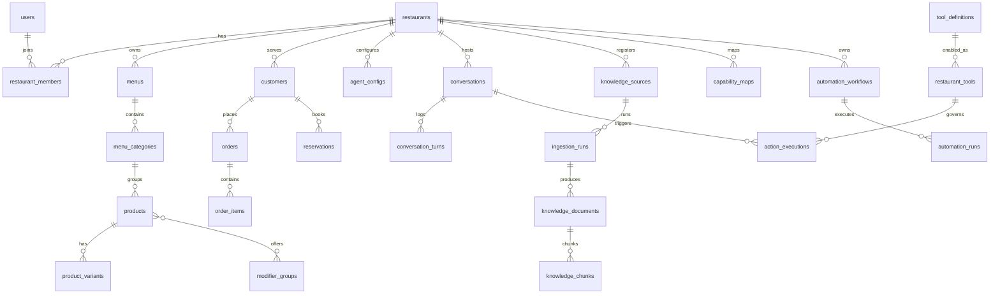

# 06 — Database Schema

PostgreSQL 16 is the system of record. One database, shared schema, tenant isolation via Row-Level Security (ADR-007), embeddings in pgvector (ADR-005). This doc defines conventions, the full table set (DDL-style, abridged types), RLS, indexing, and partitioning. Alembic migrations in Phase 2 are generated from this spec.

## 1. Conventions

- **IDs**: `uuid` primary keys, UUIDv7 (time-ordered — index-friendly), generated app-side. External references use prefixed display IDs (`res_…`, `ord_…`) derived from the UUID for logs/support.
- **Tenancy**: every tenant-owned table has `restaurant_id uuid NOT NULL REFERENCES restaurants(id)` and an RLS policy (§4). Platform tables (`users`, `tool_definitions`, …) are marked *global*.
- **Money**: `amount_minor bigint` + `currency char(3)`. Minor units follow ISO 4217 exponents — **TND has exponent 3** (1 TND = 1000 millimes), EUR/USD 2. All arithmetic in minor units; rendering handles exponent. No floats, ever.
- **Time**: `timestamptz` everywhere, UTC in storage; `restaurants.timezone` (IANA) drives all business-hours logic. `created_at`/`updated_at` on every table (trigger-maintained), omitted below for brevity.
- **Soft delete**: `deleted_at timestamptz` only where history has UX value (menus, products, agent configs). Operational rows (orders, executions, audit) are never deleted, only status-transitioned; GDPR erasure anonymizes (§7 of doc 08).
- **Enums**: Postgres enums for closed sets (statuses); `text` + CHECK for sets that may grow.
- **JSONB**: used for genuinely polymorphic payloads (configs, provenance, validation reports) — never for data we filter/join on in hot paths.

## 2. Entity overview



## 3. Tables

### 3.1 Identity & tenancy

```sql
-- GLOBAL
CREATE TABLE users (
  id              uuid PRIMARY KEY,
  email           citext UNIQUE NOT NULL,
  password_hash   text,                          -- null for OAuth-only accounts (argon2id)
  name            text NOT NULL,
  locale          text NOT NULL DEFAULT 'en',
  is_platform_admin boolean NOT NULL DEFAULT false,
  status          user_status NOT NULL DEFAULT 'active',   -- active|suspended|pending_verification
  mfa_secret_enc  bytea,
  last_login_at   timestamptz
);

CREATE TABLE oauth_accounts (                    -- GLOBAL
  id uuid PRIMARY KEY,
  user_id uuid NOT NULL REFERENCES users(id) ON DELETE CASCADE,
  provider text NOT NULL,                        -- 'google'
  provider_account_id text NOT NULL,
  UNIQUE (provider, provider_account_id)
);

CREATE TABLE restaurants (                       -- THE TENANT
  id            uuid PRIMARY KEY,
  slug          citext UNIQUE NOT NULL,          -- order.ordy.ai/{slug}
  name          text NOT NULL,
  status        restaurant_status NOT NULL DEFAULT 'onboarding',
                -- onboarding|active|suspended|churned
  timezone      text NOT NULL DEFAULT 'Africa/Tunis',
  currency      char(3) NOT NULL DEFAULT 'TND',
  default_language text NOT NULL DEFAULT 'fr',
  languages     text[] NOT NULL DEFAULT '{fr,en,ar-TN}',
  address       jsonb,
  contact       jsonb,                           -- phone, email, socials
  settings      jsonb NOT NULL DEFAULT '{}',     -- feature toggles, order caps overrides
  voice_enabled boolean NOT NULL DEFAULT false,  -- explicit go-live switch
  deleted_at    timestamptz
);

CREATE TABLE restaurant_members (
  restaurant_id uuid NOT NULL REFERENCES restaurants(id),
  user_id       uuid NOT NULL REFERENCES users(id),
  role          member_role NOT NULL,            -- owner|manager|staff|viewer
  invited_by    uuid REFERENCES users(id),
  PRIMARY KEY (restaurant_id, user_id)
);

CREATE TABLE api_keys (
  id            uuid PRIMARY KEY,
  restaurant_id uuid NOT NULL REFERENCES restaurants(id),
  name          text NOT NULL,
  key_prefix    text NOT NULL,                   -- 'ordy_live_a1b2' — displayable
  key_hash      bytea NOT NULL,                  -- sha256(full key); full key shown once
  scopes        text[] NOT NULL,                 -- e.g. {orders:read, orders:write, knowledge:read}
  expires_at    timestamptz,
  revoked_at    timestamptz,
  last_used_at  timestamptz,
  created_by    uuid REFERENCES users(id)
);
```

### 3.2 Menu

```sql
CREATE TABLE menus (
  id uuid PRIMARY KEY, restaurant_id uuid NOT NULL REFERENCES restaurants(id),
  name text NOT NULL DEFAULT 'Main menu',
  status menu_status NOT NULL DEFAULT 'draft',   -- draft|published|archived
  version int NOT NULL DEFAULT 1,
  source text NOT NULL DEFAULT 'manual',         -- manual|ingestion|api_sync|db_sync
  published_at timestamptz, deleted_at timestamptz
);

CREATE TABLE menu_categories (
  id uuid PRIMARY KEY, restaurant_id uuid NOT NULL REFERENCES restaurants(id),
  menu_id uuid NOT NULL REFERENCES menus(id),
  name text NOT NULL, name_i18n jsonb NOT NULL DEFAULT '{}',   -- {"fr": "...", "ar-TN": "..."}
  description text, sort int NOT NULL DEFAULT 0
);

CREATE TABLE products (
  id uuid PRIMARY KEY, restaurant_id uuid NOT NULL REFERENCES restaurants(id),
  category_id uuid REFERENCES menu_categories(id),
  name text NOT NULL, name_i18n jsonb NOT NULL DEFAULT '{}',
  description text, description_i18n jsonb NOT NULL DEFAULT '{}',
  price_minor bigint,                            -- null when variant-priced
  currency char(3) NOT NULL,
  image_url text,
  tags text[] NOT NULL DEFAULT '{}',             -- vegetarian, spicy, halal, popular…
  allergens text[] NOT NULL DEFAULT '{}',
  is_available boolean NOT NULL DEFAULT true,    -- fast 86-ing switch
  availability jsonb NOT NULL DEFAULT '{}',      -- optional day/time windows
  external_ref text,                             -- id in the restaurant's own system
  provenance jsonb,                              -- {url, run_id, confidence, approved_by, extracted_at}
  status product_status NOT NULL DEFAULT 'draft',-- draft|published|archived
  deleted_at timestamptz
);
CREATE INDEX products_search_idx ON products
  USING gin (to_tsvector('simple', name || ' ' || coalesce(description,'')));

CREATE TABLE product_variants (
  id uuid PRIMARY KEY, restaurant_id uuid NOT NULL REFERENCES restaurants(id),
  product_id uuid NOT NULL REFERENCES products(id) ON DELETE CASCADE,
  name text NOT NULL, name_i18n jsonb NOT NULL DEFAULT '{}',   -- 'Large'
  price_minor bigint NOT NULL,                   -- absolute price (not delta) — simpler, unambiguous
  external_ref text, sort int NOT NULL DEFAULT 0,
  is_available boolean NOT NULL DEFAULT true
);

CREATE TABLE modifier_groups (
  id uuid PRIMARY KEY, restaurant_id uuid NOT NULL REFERENCES restaurants(id),
  name text NOT NULL, name_i18n jsonb NOT NULL DEFAULT '{}',   -- 'Extra toppings'
  min_select int NOT NULL DEFAULT 0, max_select int NOT NULL DEFAULT 1,
  required boolean NOT NULL DEFAULT false
);

CREATE TABLE modifiers (
  id uuid PRIMARY KEY, restaurant_id uuid NOT NULL REFERENCES restaurants(id),
  group_id uuid NOT NULL REFERENCES modifier_groups(id) ON DELETE CASCADE,
  name text NOT NULL, name_i18n jsonb NOT NULL DEFAULT '{}',
  price_delta_minor bigint NOT NULL DEFAULT 0,
  is_available boolean NOT NULL DEFAULT true, sort int NOT NULL DEFAULT 0
);

CREATE TABLE product_modifier_groups (
  product_id uuid NOT NULL REFERENCES products(id) ON DELETE CASCADE,
  group_id uuid NOT NULL REFERENCES modifier_groups(id) ON DELETE CASCADE,
  restaurant_id uuid NOT NULL REFERENCES restaurants(id),
  sort int NOT NULL DEFAULT 0,
  PRIMARY KEY (product_id, group_id)
);

CREATE TABLE operating_hours (
  id uuid PRIMARY KEY, restaurant_id uuid NOT NULL REFERENCES restaurants(id),
  service service_type NOT NULL,                 -- dine_in|pickup|delivery|reservation
  day_of_week int NOT NULL CHECK (day_of_week BETWEEN 0 AND 6),
  opens time NOT NULL, closes time NOT NULL,     -- local to restaurants.timezone; overnight = closes < opens
  UNIQUE (restaurant_id, service, day_of_week, opens)
);

CREATE TABLE delivery_zones (
  id uuid PRIMARY KEY, restaurant_id uuid NOT NULL REFERENCES restaurants(id),
  name text NOT NULL,
  geometry jsonb NOT NULL,                       -- GeoJSON polygon or {center, radius_m}
  fee_minor bigint NOT NULL DEFAULT 0,
  min_order_minor bigint NOT NULL DEFAULT 0,
  eta_minutes int, is_active boolean NOT NULL DEFAULT true
);

CREATE TABLE promotions (
  id uuid PRIMARY KEY, restaurant_id uuid NOT NULL REFERENCES restaurants(id),
  name text NOT NULL, description text,
  rule jsonb NOT NULL,       -- {type: percent|amount|bundle, value, conditions:{min_order_minor, products[], days[], services[]}}
  valid_from timestamptz, valid_to timestamptz,
  is_active boolean NOT NULL DEFAULT true,
  provenance jsonb
);
```

### 3.3 Customers, orders, reservations

```sql
CREATE TABLE customers (                         -- per-tenant identity, phone-keyed (ADR-013)
  id uuid PRIMARY KEY, restaurant_id uuid NOT NULL REFERENCES restaurants(id),
  phone_e164 text,                               -- verified via call or OTP
  name text, language text,
  addresses jsonb NOT NULL DEFAULT '[]',
  preferences jsonb NOT NULL DEFAULT '{}',       -- usual order, allergies — via log_customer_preference tool only
  consent jsonb NOT NULL DEFAULT '{}',           -- {memory: bool, marketing: bool, recorded_at}
  stats jsonb NOT NULL DEFAULT '{}',             -- order_count, ltv_minor (denormalized)
  anonymized_at timestamptz,                     -- GDPR erasure marker
  UNIQUE (restaurant_id, phone_e164)
);

CREATE TABLE orders (
  id uuid PRIMARY KEY, restaurant_id uuid NOT NULL REFERENCES restaurants(id),
  customer_id uuid REFERENCES customers(id),
  conversation_id uuid,                          -- REFERENCES conversations(id); nullable (dashboard/API orders)
  channel order_channel NOT NULL,                -- voice_web|voice_phone|text_widget|dashboard|api
  type service_type NOT NULL,                    -- pickup|delivery|dine_in
  status order_status NOT NULL DEFAULT 'draft',
    -- draft|pending_confirmation|confirmed|preparing|ready|out_for_delivery|completed|cancelled|failed
  subtotal_minor bigint NOT NULL DEFAULT 0,
  discount_minor bigint NOT NULL DEFAULT 0,
  delivery_fee_minor bigint NOT NULL DEFAULT 0,
  total_minor bigint NOT NULL DEFAULT 0,         -- always server-computed (doc 03 §3.4)
  currency char(3) NOT NULL,
  address jsonb,                                 -- snapshot for delivery
  scheduled_for timestamptz,                     -- null = ASAP
  promotion_id uuid REFERENCES promotions(id),
  executed_via text NOT NULL DEFAULT 'native',   -- native|rest|pos|browser
  external_ref text,                             -- order id in the restaurant's system
  idempotency_key text,
  note text,
  UNIQUE (restaurant_id, idempotency_key)
);
CREATE INDEX orders_feed_idx ON orders (restaurant_id, status, created_at DESC);

CREATE TABLE order_items (
  id uuid PRIMARY KEY, restaurant_id uuid NOT NULL REFERENCES restaurants(id),
  order_id uuid NOT NULL REFERENCES orders(id) ON DELETE CASCADE,
  product_id uuid REFERENCES products(id),
  variant_id uuid REFERENCES product_variants(id),
  name_snapshot text NOT NULL,                   -- menu changes must not rewrite history
  unit_price_minor bigint NOT NULL,
  quantity int NOT NULL CHECK (quantity > 0),
  modifiers_snapshot jsonb NOT NULL DEFAULT '[]',-- [{modifier_id, name, price_delta_minor}]
  total_minor bigint NOT NULL,
  note text
);

CREATE TABLE order_events (                      -- status timeline / audit for one order
  id uuid PRIMARY KEY, restaurant_id uuid NOT NULL REFERENCES restaurants(id),
  order_id uuid NOT NULL REFERENCES orders(id) ON DELETE CASCADE,
  type text NOT NULL,                            -- created|confirmed|status_changed|edited|cancelled|sync_failed…
  actor jsonb NOT NULL,                          -- {kind: agent|staff|system|api, id}
  data jsonb NOT NULL DEFAULT '{}',
  occurred_at timestamptz NOT NULL DEFAULT now()
);

CREATE TABLE reservations (
  id uuid PRIMARY KEY, restaurant_id uuid NOT NULL REFERENCES restaurants(id),
  customer_id uuid REFERENCES customers(id),
  conversation_id uuid,
  party_size int NOT NULL CHECK (party_size > 0),
  starts_at timestamptz NOT NULL,
  duration_minutes int NOT NULL DEFAULT 90,
  status reservation_status NOT NULL DEFAULT 'pending_confirmation',
    -- pending_confirmation|confirmed|seated|completed|no_show|cancelled
  table_preference text, note text,
  executed_via text NOT NULL DEFAULT 'native',
  external_ref text, idempotency_key text,
  UNIQUE (restaurant_id, idempotency_key)
);
CREATE INDEX reservations_calendar_idx ON reservations (restaurant_id, starts_at);
```

### 3.4 Agent & conversations

```sql
CREATE TABLE agent_configs (
  id uuid PRIMARY KEY, restaurant_id uuid NOT NULL REFERENCES restaurants(id),
  name text NOT NULL DEFAULT 'Default agent',
  persona jsonb NOT NULL DEFAULT '{}',           -- tone, register, greeting per language, upsell rules
  voice jsonb NOT NULL DEFAULT '{}',             -- doc 05 §7: mode overrides, TTS voice ids, fillers
  languages text[] NOT NULL DEFAULT '{fr}',
  escalation jsonb NOT NULL DEFAULT '{}',        -- handoff triggers, staff notification targets
  model_overrides jsonb NOT NULL DEFAULT '{}',   -- per-tier model overrides (ADR-008)
  prompt_version text,                           -- pin to a released prompt bundle
  is_active boolean NOT NULL DEFAULT true,
  deleted_at timestamptz
);

CREATE TABLE conversations (
  id uuid PRIMARY KEY, restaurant_id uuid NOT NULL REFERENCES restaurants(id),
  agent_config_id uuid REFERENCES agent_configs(id),
  customer_id uuid REFERENCES customers(id),
  channel order_channel NOT NULL,
  pipeline_mode text,                            -- realtime|modular|text
  language text,
  status conversation_status NOT NULL DEFAULT 'active',
    -- active|completed|abandoned|escalated|failed
  outcome text,                                  -- order_placed|reservation_made|question_answered|handoff|none
  summary text,
  started_at timestamptz NOT NULL DEFAULT now(),
  ended_at timestamptz,
  metrics jsonb NOT NULL DEFAULT '{}'            -- turns, interruptions, latency p50/p95, tokens, audio_seconds, cost_minor
);

CREATE TABLE conversation_turns (                -- PARTITIONED BY RANGE (created_at), monthly
  id uuid NOT NULL, restaurant_id uuid NOT NULL,
  conversation_id uuid NOT NULL,
  seq int NOT NULL,
  role turn_role NOT NULL,                       -- customer|agent|system|tool
  content text,                                  -- transcript or system/tool payload summary
  content_json jsonb,                            -- structured payloads (tool calls/results, refs)
  audio_object_key text,
  latency_ms int, interrupted boolean NOT NULL DEFAULT false,
  created_at timestamptz NOT NULL DEFAULT now(),
  PRIMARY KEY (created_at, id)
);
CREATE INDEX turns_by_conv_idx ON conversation_turns (conversation_id, seq);
```

### 3.5 Knowledge & ingestion

```sql
CREATE TABLE knowledge_sources (
  id uuid PRIMARY KEY, restaurant_id uuid NOT NULL REFERENCES restaurants(id),
  kind source_kind NOT NULL,                     -- website|database|github|api_doc|upload
  config jsonb NOT NULL,                         -- url / repo; SECRETS ONLY AS VAULT REFS, never plaintext
  schedule text,                                 -- cron for re-sync
  status source_status NOT NULL DEFAULT 'active',-- active|paused|broken
  last_synced_at timestamptz
);

CREATE TABLE ingestion_runs (
  id uuid PRIMARY KEY, restaurant_id uuid NOT NULL REFERENCES restaurants(id),
  source_id uuid NOT NULL REFERENCES knowledge_sources(id),
  trigger text NOT NULL,                         -- onboarding|manual|scheduled|change_detected
  status run_status NOT NULL DEFAULT 'queued',
    -- queued|discovering|fetching|extracting|analyzing|synthesizing|awaiting_review|publishing|published|failed|rejected
  stats jsonb NOT NULL DEFAULT '{}',             -- pages, items_extracted, tokens, cost_minor, per-stage timings
  error jsonb,
  artifacts_prefix text,                         -- s3 prefix for run artifacts
  started_at timestamptz, finished_at timestamptz
);

CREATE TABLE knowledge_documents (
  id uuid PRIMARY KEY, restaurant_id uuid NOT NULL REFERENCES restaurants(id),
  source_id uuid REFERENCES knowledge_sources(id),
  run_id uuid REFERENCES ingestion_runs(id),
  doc_type doc_type NOT NULL,                    -- menu|hours|policy|faq|page|promo|code_summary
  title text NOT NULL,
  content text NOT NULL,                         -- canonical markdown
  content_hash bytea NOT NULL,                   -- change detection
  url text, language text,
  status doc_status NOT NULL DEFAULT 'draft',    -- draft|approved|archived|superseded
  provenance jsonb NOT NULL DEFAULT '{}',
  approved_by uuid REFERENCES users(id), approved_at timestamptz
);

CREATE TABLE knowledge_chunks (
  id uuid PRIMARY KEY, restaurant_id uuid NOT NULL REFERENCES restaurants(id),
  document_id uuid NOT NULL REFERENCES knowledge_documents(id) ON DELETE CASCADE,
  chunk_index int NOT NULL,
  content text NOT NULL,
  token_count int NOT NULL,
  embedding vector(1536),                        -- dim per EMBEDDING tier config; recorded in embedding_meta
  embedding_meta jsonb NOT NULL DEFAULT '{}',    -- {model, dim, embedded_at} — enables migration
  fts tsvector GENERATED ALWAYS AS (to_tsvector('simple', content)) STORED,
  metadata jsonb NOT NULL DEFAULT '{}'           -- doc_type, language, headings path
);
CREATE INDEX chunks_hnsw_idx ON knowledge_chunks USING hnsw (embedding vector_cosine_ops);
CREATE INDEX chunks_fts_idx  ON knowledge_chunks USING gin (fts);
-- retrieval always: WHERE restaurant_id = current_setting('app.restaurant_id')::uuid (RLS enforces regardless)

CREATE TABLE capability_maps (
  id uuid PRIMARY KEY, restaurant_id uuid NOT NULL REFERENCES restaurants(id),
  version int NOT NULL,
  map jsonb NOT NULL,                            -- doc 04 §3 format
  status map_status NOT NULL DEFAULT 'draft',    -- draft|approved|active|superseded
  generated_from uuid REFERENCES ingestion_runs(id),
  approved_by uuid REFERENCES users(id), approved_at timestamptz,
  UNIQUE (restaurant_id, version)
);
```

### 3.6 Tools & actions

```sql
CREATE TABLE tool_definitions (                  -- GLOBAL platform catalog (code-shipped, seeded by migration)
  id uuid PRIMARY KEY,
  key text NOT NULL, version int NOT NULL,
  title text NOT NULL, description text NOT NULL,
  risk risk_level NOT NULL,                      -- read|write|financial
  requires_confirmation boolean NOT NULL,
  idempotent boolean NOT NULL DEFAULT true,
  input_schema jsonb NOT NULL, output_schema jsonb NOT NULL,
  validators text[] NOT NULL DEFAULT '{}',
  compensation jsonb,
  is_active boolean NOT NULL DEFAULT true,
  UNIQUE (key, version)
);

CREATE TABLE restaurant_tools (                  -- tenant whitelist + binding (the ONLY path to execution)
  id uuid PRIMARY KEY, restaurant_id uuid NOT NULL REFERENCES restaurants(id),
  tool_definition_id uuid NOT NULL REFERENCES tool_definitions(id),
  enabled boolean NOT NULL DEFAULT false,
  adapter text NOT NULL,                         -- native|rest|pos|browser
  binding jsonb NOT NULL DEFAULT '{}',           -- endpoint map / pos location id / workflow_id
  caps jsonb NOT NULL DEFAULT '{}',              -- {max_order_minor, max_items, max_per_hour} — tighten-only vs platform defaults
  channels text[] NOT NULL DEFAULT '{voice_web,voice_phone,text_widget}',
  approved_by uuid REFERENCES users(id), approved_at timestamptz,
  UNIQUE (restaurant_id, tool_definition_id)
);

CREATE TABLE action_executions (                 -- PARTITIONED BY RANGE (created_at), monthly. Append-only.
  id uuid NOT NULL, restaurant_id uuid NOT NULL,
  conversation_id uuid, plan_id uuid,
  restaurant_tool_id uuid,
  tool_key text NOT NULL, tool_version int NOT NULL,
  status action_status NOT NULL,
    -- proposed|rejected|awaiting_confirmation|declined|expired|executing|succeeded|failed|compensating|compensated
  input jsonb NOT NULL,                          -- redacted per ToolSpec redaction rules
  output jsonb,
  validation_report jsonb NOT NULL DEFAULT '{}', -- every check + verdict (doc 03 §3.4)
  rejection_code text,
  confirmation jsonb,                            -- {summary_spoken, confirmed_at, turn_id}
  adapter text, external_ref text,
  idempotency_key text NOT NULL,
  latency_ms int, error jsonb,
  created_at timestamptz NOT NULL DEFAULT now(),
  PRIMARY KEY (created_at, id)
);
CREATE INDEX actions_by_conv_idx ON action_executions (conversation_id, created_at);
CREATE INDEX actions_by_tenant_idx ON action_executions (restaurant_id, created_at DESC);
```

### 3.7 Automation

```sql
CREATE TABLE automation_workflows (
  id uuid PRIMARY KEY, restaurant_id uuid NOT NULL REFERENCES restaurants(id),
  action_key text NOT NULL,                      -- which tool this workflow implements
  version int NOT NULL DEFAULT 1,
  target_domain text NOT NULL,
  definition jsonb NOT NULL,                     -- doc 04 §6 step format
  status workflow_status NOT NULL DEFAULT 'draft',
    -- draft|verifying|verified|active|degraded|disabled
  last_verified_at timestamptz,
  failure_count int NOT NULL DEFAULT 0,
  created_from uuid REFERENCES ingestion_runs(id),
  approved_by uuid REFERENCES users(id), approved_at timestamptz
);

CREATE TABLE automation_runs (
  id uuid PRIMARY KEY, restaurant_id uuid NOT NULL REFERENCES restaurants(id),
  workflow_id uuid NOT NULL REFERENCES automation_workflows(id),
  action_execution_id uuid,                      -- link to the governing action
  kind text NOT NULL,                            -- live|dry_run|verification
  status text NOT NULL,                          -- queued|running|succeeded|failed|aborted
  current_step int, step_results jsonb NOT NULL DEFAULT '[]',
  artifacts_prefix text NOT NULL,                -- screenshots + DOM snapshots per step
  error jsonb, started_at timestamptz, finished_at timestamptz
);
```

### 3.8 Platform: audit, webhooks, billing

```sql
CREATE TABLE audit_logs (                        -- PARTITIONED BY RANGE (occurred_at), monthly. Append-only, GLOBAL+tenant.
  id uuid NOT NULL,
  restaurant_id uuid,                            -- null for platform-level events
  actor jsonb NOT NULL,                          -- {kind: user|agent|api_key|system|admin, id, ip}
  action text NOT NULL,                          -- 'menu.publish', 'tool.enable', 'auth.login_failed', …
  resource_type text, resource_id uuid,
  data jsonb NOT NULL DEFAULT '{}',
  occurred_at timestamptz NOT NULL DEFAULT now(),
  PRIMARY KEY (occurred_at, id)
);

CREATE TABLE webhook_endpoints (
  id uuid PRIMARY KEY, restaurant_id uuid NOT NULL REFERENCES restaurants(id),
  url text NOT NULL,
  secret_enc bytea NOT NULL,                     -- HMAC secret, envelope-encrypted
  events text[] NOT NULL,                        -- subscribed event types (doc 07 §5)
  is_active boolean NOT NULL DEFAULT true,
  failure_count int NOT NULL DEFAULT 0           -- auto-disable threshold + notification
);

CREATE TABLE webhook_deliveries (
  id uuid PRIMARY KEY, restaurant_id uuid NOT NULL REFERENCES restaurants(id),
  endpoint_id uuid NOT NULL REFERENCES webhook_endpoints(id),
  event_type text NOT NULL, event_id uuid NOT NULL,
  payload jsonb NOT NULL,
  status text NOT NULL DEFAULT 'pending',        -- pending|delivered|failed|dead
  attempts int NOT NULL DEFAULT 0, next_retry_at timestamptz,
  last_response jsonb
);

CREATE TABLE subscriptions (
  id uuid PRIMARY KEY, restaurant_id uuid UNIQUE NOT NULL REFERENCES restaurants(id),
  stripe_customer_id text, stripe_subscription_id text,
  plan text NOT NULL DEFAULT 'trial',            -- trial|starter|pro|scale
  status text NOT NULL,                          -- trialing|active|past_due|canceled
  current_period_end timestamptz,
  limits jsonb NOT NULL DEFAULT '{}'             -- included minutes/conversations per plan
);

CREATE TABLE usage_records (                     -- metering: billing + margin (ADR-014)
  id uuid PRIMARY KEY, restaurant_id uuid NOT NULL REFERENCES restaurants(id),
  metric text NOT NULL,                          -- conversations|audio_seconds|llm_tokens|stt_seconds|tts_chars|actions|ingestion_tokens
  quantity bigint NOT NULL,
  cost_minor bigint,                             -- our vendor cost (margin tracking)
  meta jsonb NOT NULL DEFAULT '{}',              -- {tier, model, conversation_id}
  occurred_on date NOT NULL,
  recorded_at timestamptz NOT NULL DEFAULT now()
);
CREATE INDEX usage_rollup_idx ON usage_records (restaurant_id, metric, occurred_on);
```

## 4. Row-Level Security pattern

Applied to **every** table carrying `restaurant_id`:

```sql
ALTER TABLE orders ENABLE ROW LEVEL SECURITY;
ALTER TABLE orders FORCE ROW LEVEL SECURITY;    -- applies even to the table owner

CREATE POLICY tenant_isolation ON orders
  USING (restaurant_id = current_setting('app.restaurant_id')::uuid);

CREATE POLICY platform_admin_read ON orders FOR SELECT
  USING (current_setting('app.role', true) = 'platform_admin');
```

- The application connects as `ordy_app` (no BYPASSRLS). Request middleware and every Celery task entrypoint run `SET LOCAL app.restaurant_id = '<uuid>'` inside the transaction — PgBouncer transaction-mode safe.
- Migrations run as `ordy_migrator`. Admin-panel reads run as `ordy_app` with `app.role = 'platform_admin'` set only by the admin-authenticated code path.
- CI includes an isolation suite: for every RLS table, attempt cross-tenant `SELECT/UPDATE/DELETE` and assert zero rows.

## 5. Partitioning & retention

| Table | Strategy | Why |
|---|---|---|
| `conversation_turns` | Monthly range partitions | Highest write volume; retention drops = partition drops |
| `action_executions` | Monthly range partitions | Append-only audit of every action |
| `audit_logs` | Monthly range partitions | Append-only; long retention (24 mo default) |
| `webhook_deliveries` | Simple age-based purge (90 d) | Operational, not audit |
| everything else | Unpartitioned | Modest volume |

Retention defaults (tenant-tunable within legal bounds): transcripts 12 mo → summarized; audio 30 d; audit 24 mo; usage records kept aggregated indefinitely. GDPR erasure = `customers.anonymized_at` + scrub of PII fields in place (turn content hashed-redacted), preserving financial/audit integrity (doc 08 §7).
